# Branch Topology — scaffold_2

```mermaid
flowchart TB
    direction TB

    %% Phase 0 — Utility
    subgraph phase0["Phase 0 — Utility"]
        main0["main"]
        null0["null"]
    end

    %% Phase 1 — Planning
    subgraph phase1["Phase 1 — Planning"]
        p01["01_rough-plan"]
        p02c["02_context"]
        p02p["02_plan"]
    end

    %% Phase 2 — Standards
    subgraph phase2["Phase 2 — Standards"]
        ui_imp["ui/impeccable"]
    end

    %% Phase 3 — Specs
    subgraph phase3["Phase 3 — Specs"]
        s_fe_tech["spec/front-end_tech-stack"]
        s_be_tech["spec/back-end_tech-stack"]
        s_fe_typ["spec/front-end_typography"]
        s_fe_color["spec/front-end_color-scheme"]
        s_fe_nav["spec/front-end_navbar"]
        s_fe_foot["spec/front-end_footer"]
        s_fe_shell["spec/front-end_app-shell"]
        s_fe_hero["spec/front-end_hero"]
        s_fe_home["spec/front-end_homepage"]
    end

    %% Phase 4 — Testing
    subgraph phase4["Phase 4 — Testing"]
        t_fe_typ["testing/front-end_typography"]
        t_fe_color["testing/front-end_color-scheme"]
        t_fe_nav["testing/front-end_navbar"]
        t_fe_foot["testing/front-end_footer"]
        t_fe_shell["testing/front-end_app-shell"]
        t_fe_hero["testing/front-end_hero"]
        t_fe_home["testing/front-end_homepage"]
        t_be_tech["testing/back-end_tech-stack"]
    end

    %% Phase 5 — Implementation
    subgraph phase5["Phase 5 — Implementation"]
        i_fe_tech["impl/front-end_tech-stack"]
        i_be_tech["impl/back-end_tech-stack"]
        i_fe_shell["impl/front-end_app-shell"]
        i_fe_typ["impl/front-end_typography"]
        i_fe_color["impl/front-end_color-scheme"]
        i_fe_nav["impl/front-end_navbar"]
        i_fe_foot["impl/front-end_footer"]
        i_fe_hero["impl/front-end_hero"]
        i_fe_home["impl/front-end_homepage"]
    end

    %% Phase 7 — QA
    subgraph phase7["Phase 7 — QA"]
        stg_v1["staging/v1"]
        bf_nav["bug-fixes/front-end_navbar-nav-fix"]
        dep_v1["deployment/v1"]
        dep_v2["deployment/v2"]
    end

    %% Fork relationships (solid — git inheritance)
    s_fe_typ --> t_fe_typ
    s_fe_color --> t_fe_color
    s_fe_nav --> t_fe_nav
    s_fe_foot --> t_fe_foot
    s_fe_shell --> t_fe_shell
    s_fe_hero --> t_fe_hero
    s_fe_home --> t_fe_home
    s_be_tech --> t_be_tech

    i_fe_shell --> i_fe_typ
    i_fe_shell --> i_fe_color
    i_fe_shell --> i_fe_nav
    i_fe_shell --> i_fe_foot
    i_fe_shell --> i_fe_hero
    i_fe_shell --> i_fe_home

    i_fe_shell -.-> stg_v1
    i_fe_nav -.-> bf_nav

    %% Quasi-dependencies (dashed — informational flow)
    p01 -.-> p02c
    p02c -.-> p02p
    p02p -.-> s_fe_tech
    p02p -.-> s_be_tech
    p02p -.-> s_fe_typ
    p02p -.-> s_fe_color
    p02p -.-> s_fe_nav
    p02p -.-> s_fe_foot
    p02p -.-> s_fe_shell
    p02p -.-> s_fe_hero
    p02p -.-> s_fe_home

    ui_imp -.-> i_fe_tech
    ui_imp -.-> i_fe_typ
    ui_imp -.-> i_fe_color
    ui_imp -.-> i_fe_nav
    ui_imp -.-> i_fe_foot
    ui_imp -.-> i_fe_shell
    ui_imp -.-> i_fe_hero
    ui_imp -.-> i_fe_home

    stg_v1 -.-> dep_v1

    %% Styles
    classDef orphan fill:#f9f,stroke:#333,stroke-width:2px
    classDef fork fill:#bbf,stroke:#8B0000,stroke-width:2px
    class main0,null0,p01,p02c,p02p,ui_imp,i_fe_tech,i_be_tech,i_fe_shell,dep_v1,dep_v2 orphan
    class t_fe_typ,t_fe_color,t_fe_nav,t_fe_foot,t_fe_shell,t_fe_hero,t_fe_home,t_be_tech,i_fe_typ,i_fe_color,i_fe_nav,i_fe_foot,i_fe_hero,i_fe_home,stg_v1,bf_nav fork
```

**Legend**
- Rectangle node = orphan branch (no git parent)
- Rounded rectangle node = fork branch (git parent-child)
- Solid arrow = git fork inheritance
- Dashed arrow = quasi-dependency (informational flow only)

## Branch Counts

| Phase | Count | Type |
|-------|-------|------|
| Phase 0 — Utility | 2 | orphan |
| Phase 1 — Planning | 3 | orphan |
| Phase 2 — Standards | 1 | orphan |
| Phase 3 — Specs | 9 | orphan |
| Phase 4 — Testing | 8 | fork |
| Phase 5 — Implementation | 9 | 3 orphan + 6 fork |
| Phase 7 — QA | 4 | 2 orphan + 2 fork |
| **Total** | **36** | |

## Notes

- **Orphan branches** (rectangle): created from `null` or no parent — stand alone.
- **Fork branches** (rounded rectangle with red border): inherit from a parent branch via `git fork` or equivalent.
- **Solid arrows**: actual git fork relationships (parent → child).
- **Dashed arrows**: quasi-dependencies (informational flow only, not git inheritance).