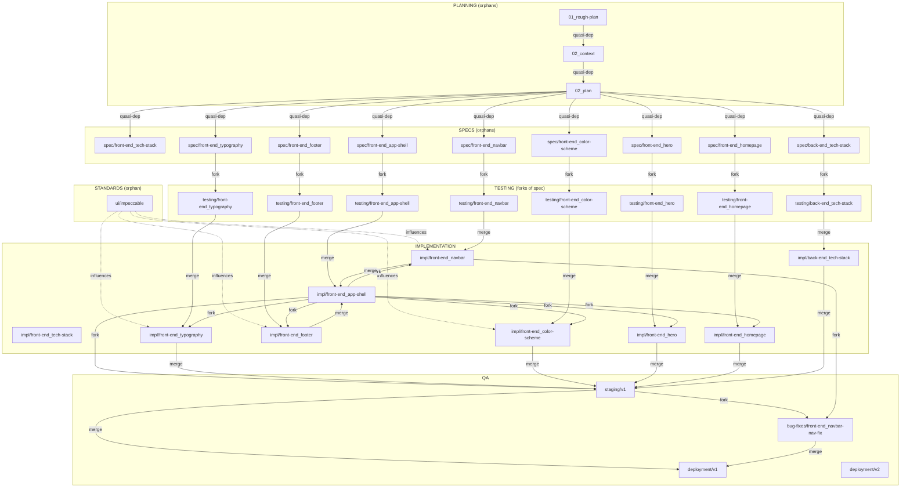

# Branch Map — scaffold_2

## Core Flow (per feature)

```
spec/<feature> ──fork──→ testing/<feature> ──merge──→ impl/<feature>
impl/<feature> is a fork of impl/front-end_app-shell
impl/<feature> ──merge──→ staging/v1
```

**Minor feature path:** `impl/<feature>` → `staging/v1` directly. No testing branch.

## Branch Types

| Prefix | Type | Purpose |
|--------|------|---------|
| `01_rough-plan` | orphan | Brainstorming: rough idea, MVP scope, future releases |
| `02_context` | orphan | Precise scope setting using flowtress-docker/context |
| `02_plan` | orphan | Detailed MVP plan demarcated in subfolders with .md + .toml |
| `ui/impeccable` | orphan | UI standards and anti-patterns (pbakaus/impeccable) |
| `spec/*` | orphan | Feature specifications: behavior, branding, UX copy, anti-patterns |
| `impl/*` | fork or orphan | Minimal implementation of specs |
| `testing/*` | fork | Spec-driven TDD: fork of spec, merged into impl |
| `staging/*` | fork | Integration staging: fork of impl/app-shell, merges from impl/* |
| `bug-fixes/*` | fork | Bug fixes: fork of impl or staging |
| `deployment/*` | orphan | Production-ready: merges from staging + bug-fixes |

## Complete Topology



## App-Shell Special Case

```
spec/front-end_app-shell ──fork──→ testing/front-end_app-shell
testing/front-end_app-shell ──merge──→ impl/front-end_app-shell
impl/front-end_navbar ──merge──→ impl/front-end_app-shell
impl/front-end_footer ──merge──→ impl/front-end_app-shell
impl/front-end_app-shell ──fork──→ impl/front-end_hero
impl/front-end_app-shell ──fork──→ impl/front-end_homepage
```

App-shell testing loop starts **after** navbar + footer are merged.

## Orphan Branches

| Branch | Reason |
|--------|--------|
| `01_rough-plan` | Planning |
| `02_context` | Planning |
| `02_plan` | Planning |
| `ui/impeccable` | Standards reference |
| `spec/*` (all 9) | Specifications |
| `impl/front-end_tech-stack` | Dependency resolution only, no fork parent |
| `impl/back-end_tech-stack` | Backend boilerplate, no fork parent |
| `impl/front-end_app-shell` | Merge target, no fork parent |
| `deployment/*` (all) | Deployment artifacts |

## Fork Relationships

| Branch | Parent | Reason |
|--------|--------|--------|
| `testing/*` | `spec/*` | Spec-driven TDD |
| `impl/front-end_typography` | `impl/front-end_app-shell` | Fork of app-shell |
| `impl/front-end_color-scheme` | `impl/front-end_app-shell` | Fork of app-shell |
| `impl/front-end_navbar` | `impl/front-end_app-shell` | Fork of app-shell |
| `impl/front-end_footer` | `impl/front-end_app-shell` | Fork of app-shell |
| `impl/front-end_hero` | `impl/front-end_app-shell` | Fork of app-shell |
| `impl/front-end_homepage` | `impl/front-end_app-shell` | Fork of app-shell |
| `staging/v1` | `impl/front-end_app-shell` | Integration staging base |
| `bug-fixes/*` | `impl/*` or `staging/*` | Bug fix isolation |

## Key Decisions (Context for scaffold_2 Logic)

These decisions guide scaffold_2 logic but are NOT functions in the code. They inform branch creation topology, not runtime behavior.

1. **Most impl branches fork from app-shell** — provides a clean ground for minimal implementations. Each impl branch inherits the app-shell base without inheriting other impl branch history.

2. **Testing forks from spec, merges into impl** — spec-driven TDD. Testing branch is the proving ground. When approved, it merges into the impl branch (which is a fork of app-shell).

3. **App-shell is the merge target for navbar + footer** — impl/front-end_navbar and impl/front-end_footer merge into impl/front-end_app-shell. App-shell is the composite result.

4. **App-shell testing loop starts after navbar + footer merge** — the app-shell spec is written first, but the testing loop for app-shell only begins once navbar and footer components are finalized and merged.

5. **Staging forks from app-shell** — staging/v1 is a fork of app-shell, not a merge result. This gives staging its own history to receive merges from other impl branches.

6. **Back-end merges into front-end staging** — `impl/back-end_tech-stack` merges into `staging/v1` to verify front-end + back-end integration.

7. **Minor features skip testing loop** — simple, non-error-prone features go impl → staging directly.

8. **Orphan/fork decisions are developer discretion** — scaffold_2 creates the branch topology. The developer decides at runtime which branches to fork, merge, or skip. This document captures the intended logic, not enforcement rules.